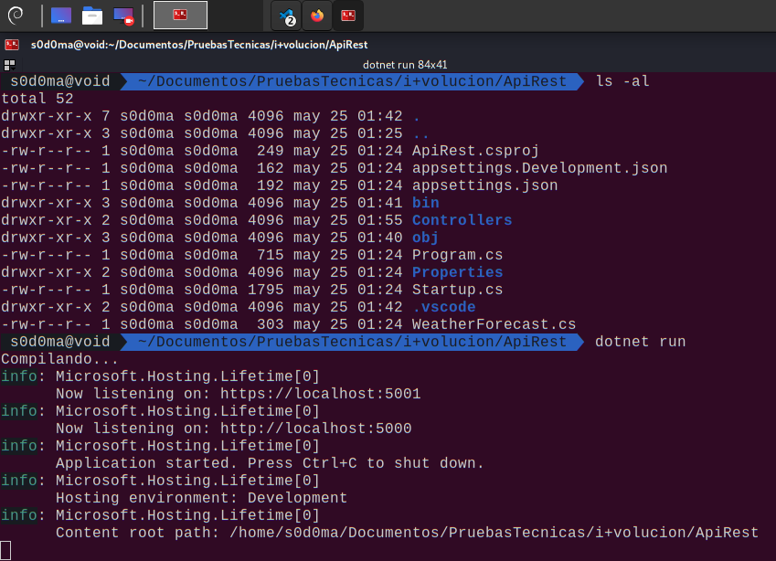
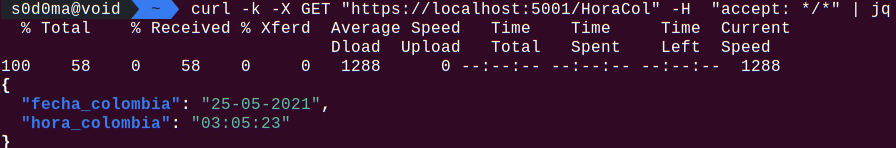
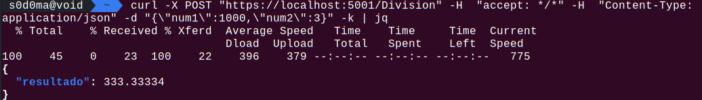
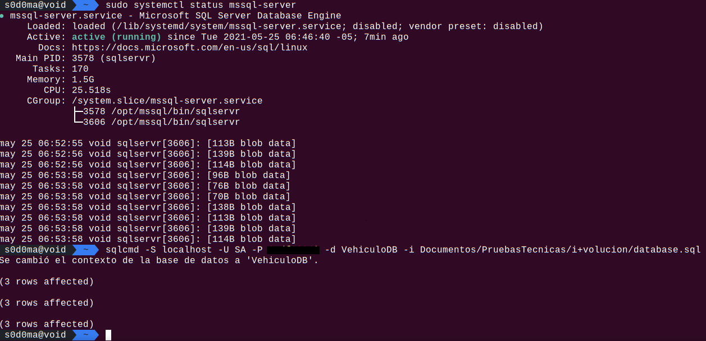
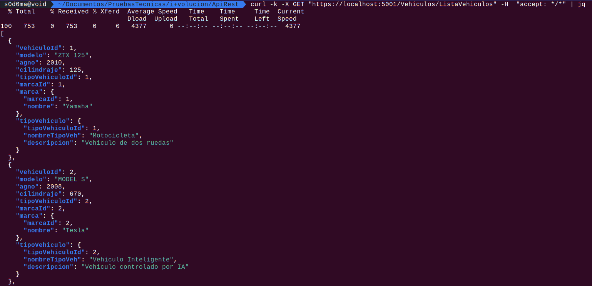
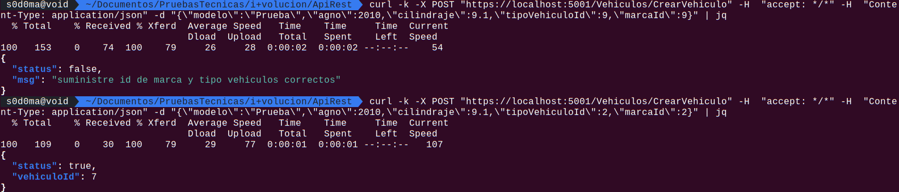
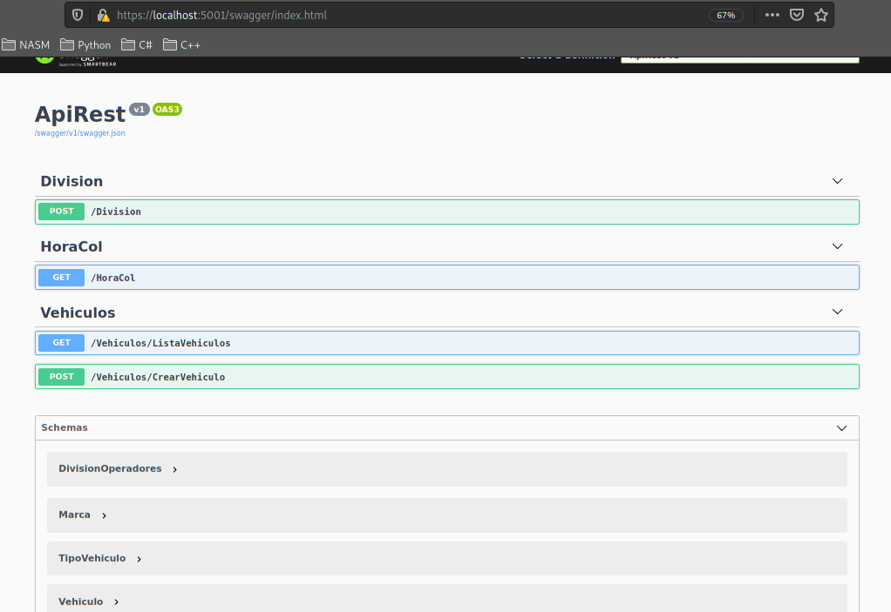
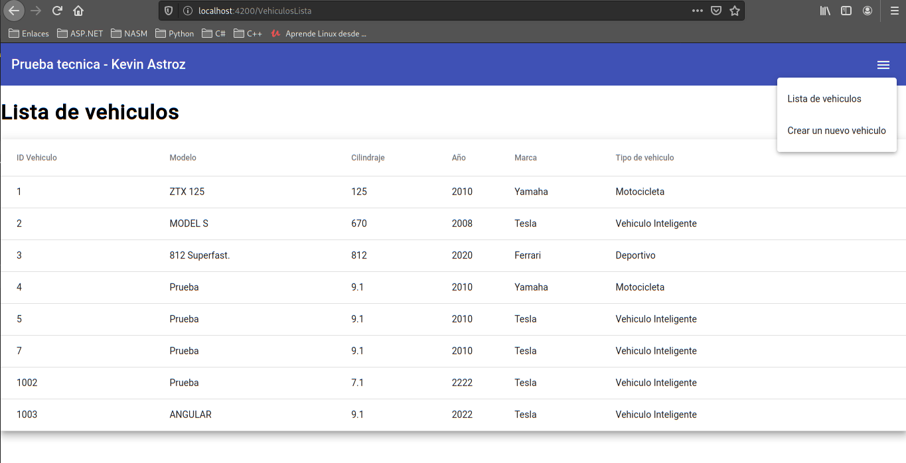
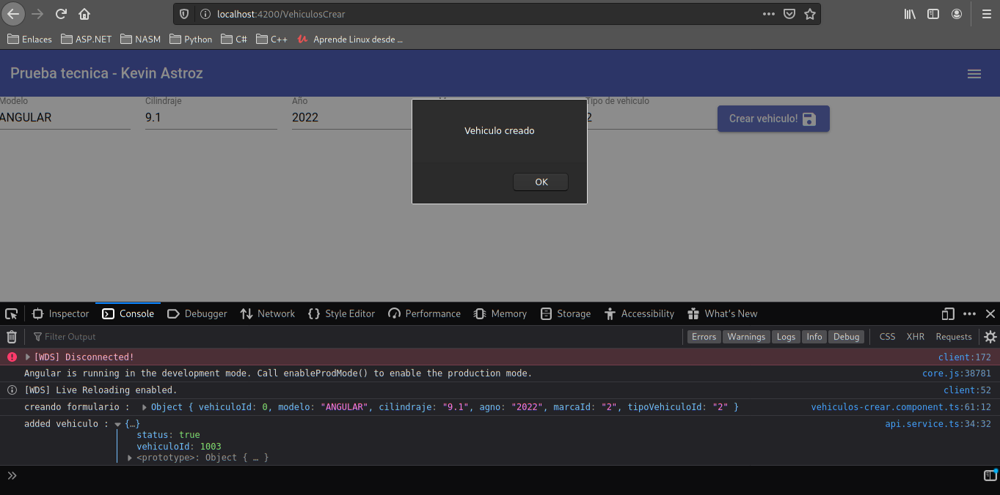

# BACKEND

## CREACION DE WEBAPI

comando de creacion de proyecto webapi

`dotnet new webapi --name ApiRest`

comando de ejecucion de solucion

`dotnet run`



## ENDPOINT QUE RETORNA LA HORA COLOMBIANA (GET /HoraCol)

Se obtiene la hora y fecha colombiana en el formato requerido a partir de las zonas horarias del sistema operativo, se valida si la aplicacion se esta ejecutando en windows o linux ya que en ambos sistemas operativos los Ids de las zonas horarias se almacenan de manera diferente, en linux en `TimeZoneId /usr/share/zoneinfo/America/Bogota` y en windows se puede ver el listado de timezone con el comando `tzutil -l`. Se realiza esta comprobacion por si la aplicacion se despliegua en linux o en windows.

> metodo del controlador `Controllers/HoraCol.cs`

```csharp
[HttpGet]
public ActionResult Get()
{
    string timeZoneId = "";

    // se valida sobre que SO se esta ejecutando la aplicacion y se
    // asigna el Time Zone Id correspondiente al SO
    // README : https://devblogs.microsoft.com/dotnet/cross-platform-time-zones-with-net-core/
    if(RuntimeInformation.IsOSPlatform(OSPlatform.Linux))
    {
        // PATH TimeZoneId /usr/share/zoneinfo/America/Bogota
        timeZoneId = "America/Bogota";
    }
    else if(RuntimeInformation.IsOSPlatform(OSPlatform.Windows))
    {
        // SA Pacific Standard Time  -  Bogota, Lima, Quito, Rio Branco
        // https://docs.microsoft.com/en-us/windows-hardware/manufacture/desktop/default-time-zones
        timeZoneId = "SA Pacific Standard Time";
    }
    else
    {
        return Problem("TimeZoneID no encontrado (win/linux)");
    }

    // Obtener TimeZoneInfo a partir de TimeZoneId
    var coTimeZone = TimeZoneInfo.FindSystemTimeZoneById(timeZoneId);

    // Convertir TimeZoneInfo a DateTime
    DateTime coTime = TimeZoneInfo.ConvertTime(
        DateTime.Now, 
        TimeZoneInfo.Local, 
        coTimeZone
    );

    // Creacion de objeto anonimo para retonar informacion
    var horaActualColombia = new {
        fecha_colombia = coTime.ToString("dd-mm-yyyy"),
        hora_colombia = coTime.ToString("HH:mm:ss")
    };

    // retornar objeto horaActualColombia
    return Ok(horaActualColombia);

}
```

> envio de peticion `curl`



## ENDPOINT - RECIBE : Num1, Num2 - RETORNA : Num1/Num2 (POST /Division)

> Metodo de controlador `Controllers/Division.cs`

```csharp
[HttpPost]
public IActionResult Post(DivisionOperadores operadores)
{

    if(!ModelState.IsValid)
    {
        return BadRequest();
    }

    return Ok(new { resultado = operadores.Result });
}
```

> Clase custom que recibe el json de los numeros con sus respectivos decoradores para validar la informacion (Decorador NotMapped para excluirlo de la base de datos) `Models/CustomModels/DivisionOperadores.cs`

```csharp
using System.ComponentModel.DataAnnotations;
using System.ComponentModel.DataAnnotations.Schema;

namespace ApiRest.Models.CustomModels
{
    [NotMapped]
    public class DivisionOperadores
    {
        [Required(ErrorMessage="Num1 es requerido")]
        public float Num1 { get; set; }

        [Required(ErrorMessage="Num2 es requerido")]
        [RequiredGreaterThanZero(ErrorMessage="Num2 diferente que 0")]
        public float Num2 { get; set; }

        public float Result { 
            get { return Num1 / Num2; } 
        }
    }

    public class RequiredGreaterThanZero : ValidationAttribute
    {
        public override bool IsValid(object value)
        {
            float i;
            return value != null && float.TryParse(value.ToString(), out i) && i > 0;
        }
    }    
}

```

> envio de peticion `curl`




## CREACION DE BASE DE DATOS VehiculoDb

Se debe crear una base de datos llamada VehiculoDB y con sqlcmd se carga el siguente script

`sqlcmd -S localhost -U SA -P 123456 -d VehiculoDB -i Documentos/PruebasTecnicas/i+volucion/database.sql`

```sql
use [VehiculoDB];

-- CREACION DE TABLAS
create table TipoVehiculo(
    TipoVehiculoId int primary key IDENTITY(1,1) NOT NULL,
    NombreTipoVeh varchar(50) NOT NULL, 
    Descripcion varchar(50) NOT NULL 
);

create table Marca(
    MarcaId int primary key IDENTITY(1,1) NOT NULL,
    Nombre varchar(50) NOT NULL
);

create table Vehiculo(
    VehiculoId int primary key IDENTITY(1,1) NOT NULL,
    Modelo varchar(50) NOT NULL,
    Agno smallint NOT NULL,
    Cilindraje float NOT NULL,
    TipoVehiculoId int NOT NULL,
    MarcaId int NOT NULL
);


-- LLAVES FORANEAS

ALTER TABLE Vehiculo
ADD CONSTRAINT FK_Vehiculo_TipoVehiculo
FOREIGN KEY (TipoVehiculoId) REFERENCES TipoVehiculo(TipoVehiculoId);

ALTER TABLE Vehiculo
ADD CONSTRAINT FK_Vehiculo_Marca
FOREIGN KEY (MarcaId) REFERENCES Marca(MarcaId);

-- REGISTROS INICIALES

INSERT TipoVehiculo(NombreTipoVeh, Descripcion)
VALUES 
('Motocicleta','Vehiculo de dos ruedas'),
('Vehiculo Inteligente','Vehiculo controlado por IA'),
('Deportivo','Vehiculo con enfasis en velocidad');

INSERT MARCA(Nombre)
VALUES 
('Yamaha'),
('Tesla'),
('Ferrari');

INSERT Vehiculo(Modelo, Agno, Cilindraje, TipoVehiculoId, MarcaId)
VALUES
('ZTX 125', 2010, 125, 1, 1),
('MODEL S', 2008, 670, 2, 2),
('812 Superfast.', 2020, 812, 3, 3);

```

> carga base de datos



> instalacion de dependencias:

`dotnet add package Microsoft.EntityFrameWorkCore.SqlServer`

`dotnet add package Microsoft.EntityFrameWorkCore.Design`

> Creacion de modelos

`dotnet ef dbcontext scaffold "Server=127.0.0.1;Database=VehiculoDB;ConnectRetryCount=0; User ID=sa;Password=123456" Microsoft.EntityFrameworkcore.SqlServer -o Models -c "VehiculoDBCTX" -d --force`

## ENDPOINT RETORNA TODOS LOS VEHICULOS CON SU MARCA Y TIPO DE VEHICULO (GET /VehiculosDB/Listado)

> controlador `Controllers/Vehiculos.cs`

```csharp
// listar todos los vehiculos
[HttpGet("ListaVehiculos")]
public async Task<IActionResult> GetVehiculos()
{
    List<Vehiculo> listaVehiculos = await VehiculoDbCtx.Vehiculos
                                            .Include("Marca")
                                            .Include("TipoVehiculo")
                                            .ToListAsync();

    return Ok(listaVehiculos);
}
```

> peticion con `curl`



## ENDPOINT CREACION DE UN NUEVO VEHICULO (POST /VehiculosDB/Creacion)

> controlador

```csharp
// crear vehiculo nuevo
[HttpPost("CrearVehiculo")]
public async Task<IActionResult> PostVehiculo(Vehiculo vehiculo)
{
    // verificar que el modelo venga bien
    if(!ModelState.IsValid)
    {
        return BadRequest();
    }

    // obtener marca y tipo de vehiculo para la insercion
    Marca _marca = await VehiculoDbCtx.Marcas.FindAsync(vehiculo.MarcaId);
    TipoVehiculo _tvehiculo = await VehiculoDbCtx.TipoVehiculos.FindAsync(vehiculo.TipoVehiculoId);

    // si no existe marca o tipo de vehiculo muestra mensaje de error
    if( _marca == null || _tvehiculo == null)
    {
        return Ok(new { status = false, msg = "suministre id de marca y tipo vehiculos correctos" });
    }
    else
    {
        // se inserta registro nuevo 
        VehiculoDbCtx.Vehiculos.Add(vehiculo);
        int registrosAgregados = await VehiculoDbCtx.SaveChangesAsync();

        // se verifica que se agregara
        if(registrosAgregados > 0)
        {
            // mensaje ok
            return Ok(new {status = true, VehiculoId = vehiculo.VehiculoId});
        }
        else
        {
            // mensaje fail
            return Ok(new {status = false});
        }
    }
}
```

> peticion `curl`



## Swagger



# FRONTEND

path : `FrontEnd`
exec : `ng serve`

El frontend fue desarrollado en angular 8 y material. se crearon un componente para visualizar la lista de vehiculos y otro componente para la creacion de vehiculos.

## Lista de vehiculos



## Creacion de vehiculos



